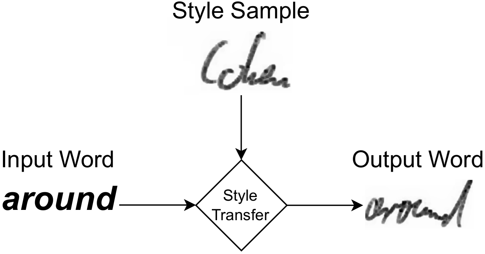

# HTR Style-Transfer Personalization

This repository contains the code for the ICDAR 2026 paper  
**“Limits of Style-Transferred Synthetic Data for Ad-hoc Personalization in Handwritten Text Recognition.”**

## Overview

This work investigates whether style-transferred synthetic handwriting can be used for ad-hoc personalization in handwritten text recognition (HTR). The goal is to adapt a generic HTR model to a new writer using only a small number of real handwriting samples.

<p align="center">
  <br>
  <em>Example of transferring a writer's handwriting style to new text.</em>
</p>

The experiments compare real-data personalization with one-shot and few-shot style-transfer personalization. The results show that real writer-specific samples can improve HTR performance, while the tested style-transferred synthetic data does not provide a measurable personalization benefit under the evaluated conditions.

## Experiments

The repository reproduces the main experimental conditions from the paper:

1. Baseline evaluation of the generic AttentionHTR model,
2. Progressive real-data personalization on GoBo using the target writer's own samples,
3. Random-writer control, i.e. failed “personalization” when using samples from a different writer,
4. Word-group personalization on GoBo,
5. One-shot and few-shot style-transfer personalization,
6. Mixed real/synthetic personalization,
7. Ordered real-then-synthetic personalization,
8. Progressive large-scale style-transfer personalization with up to 10,000 synthetic samples,
9. Binarization experiments.

## Repository Structure

```text
.
├── config.py                                # paths, training settings, and experiment switches
├── run_experiments.py                       # main entry point for running selected experiments
├── requirements.txt                         # dependencies except CUDA-specific PyTorch packages
├── generate_synthetic/                      # optional scripts for regenerating synthetic GoBo data
│   ├── one_dm_gobo.py                       # One-DM one-shot GoBo-style generation
│   ├── vatr_gobo.py                         # VATr few-shot GoBo-style generation
│   ├── vatr_few_shot_10k_common_words.py    # VATr generation for the 10k common-word setup
│   └── common_words_10k.txt                 # target vocabulary for the 10k setup
└── htr_personalization/
    ├── download_resources.py                # downloads datasets and model checkpoint
    ├── attention_htr_adapter.py             # wrapper around the external AttentionHTR implementation
    ├── gobo_preparation.py                  # GoBo train/test preparation and sampling
    ├── style_transfer_preparation.py        # preparation of mixed and ordered real/synthetic folders
    ├── result_tables.py                     # CSV writing and printed result summaries
    └── experiments/
        ├── baseline.py
        ├── real_data.py
        ├── word_groups.py
        ├── style_transfer.py
        ├── mixed_real_synthetic.py
        ├── ordered_real_then_synthetic.py
        └── binarization.py
```

## Installation

It is recommended to install the project inside a virtual environment to avoid dependency conflicts.

### 1. Create and activate a virtual environment

Windows:

```bash
python -m venv venv
venv\Scripts\activate
```

Linux / macOS:

```bash
python3.11 -m venv venv
source venv/bin/activate
```

### 2. Install PyTorch

PyTorch is required for running the experiments. Since the correct PyTorch build depends on the operating system, GPU, and CUDA version, it is installed separately from `requirements.txt`.

The following command was used in our setup with an NVIDIA GPU and CUDA 12.8:

```bash
pip install torch==2.11.0 torchvision==0.26.0 torchaudio==2.11.0 --index-url https://download.pytorch.org/whl/cu128
```

Users with a different setup should install the matching PyTorch version before installing the remaining dependencies.

### 3. Install the remaining dependencies

```bash
pip install -r requirements.txt
```

## Running Experiments

After installing the dependencies, enable the experiments you want to run in `config.py`.

Set at least one `RUN_*` flag to `True` before starting the experiment pipeline. See [Configuration](#configuration) for details.

Then run:

```bash
python run_experiments.py
```

The script automatically downloads the resources required for the enabled experiments. If the required files are already available locally, they are reused and are not downloaded again. See [Data and External Resources](#data-and-external-resources) for details.

Result CSV files are saved under `experiment_results/`, with separate subfolders for each enabled experiment.

## Configuration

Experiments are controlled through `config.py`. By default, all `RUN_*` flags are set to `False` to avoid accidentally starting long GPU runs. 

The main experiment switches are:

```python
RUN_BASELINE_EVALUATION = False          # Generic AttentionHTR baseline
RUN_REAL_PERSONALIZATION = False         # RealData (actual writer) personalization
RUN_RANDOM_WRITER_CONTROL = False        # RealData (random writer) control; can run alone
RUN_WORD_GROUP_PERSONALIZATION = False   # GoBo word-group personalization
RUN_STYLE_TRANSFER_ONE_SHOT = False      # One-shot synthetic personalization
RUN_STYLE_TRANSFER_FEW_SHOT = False      # Few-shot synthetic personalization
RUN_MIXED_REAL_SYNTHETIC = False         # Mixed real/synthetic personalization
RUN_ORDERED_REAL_THEN_SYNTHETIC = False  # Real data first, then synthetic data
RUN_BIG_STYLE_TRANSFER = False           # Progressive 10,000-sample synthetic personalization
RUN_BINARIZATION_EXPERIMENT = False      # Style Transfer (Binarization) and Big Style Transfer (Binarization)
```

The main training settings are:

```python
BATCH_SIZE = 10      # batch size for personalization training
EPOCHS = 5           # number of fine-tuning epochs
TEST_SAMPLES = 398   # number of GoBo test samples per writer
RANDOM_SEED = 1      # random seed for reproducible sampling
```


Progressive sample settings are used for real-data personalization and for the random-writer control:

```python
BEGIN_SAMPLES = 10   # first real-data personalization step
END_SAMPLES = 530    # upper bound; final step uses all available GoBo training samples
STEP_SAMPLES = 10    # sample increase per step
```

The random-writer control can be executed independently by setting only `RUN_RANDOM_WRITER_CONTROL = True`. If both `RUN_REAL_PERSONALIZATION` and `RUN_RANDOM_WRITER_CONTROL` are enabled, the random-writer control reuses the models trained during real-data personalization instead of training the same source-writer models twice.

Other experiments have separate settings. For example:

```python
MIXED_REAL_SYNTHETIC_RATIOS = [(0.90, 0.10), (0.80, 0.20), (0.50, 0.50)]  # defines the real/synthetic ratios for the mixed experiment
ORDERED_REAL_LIMIT = 250             # number of real samples used before adding synthetic data
ORDERED_STEP_SAMPLES = 50            # synthetic samples added per ordered-training step
BIG_STYLE_TRANSFER_BEGIN_SAMPLES = 500   # first 10k synthetic personalization step
BIG_STYLE_TRANSFER_END_SAMPLES = 10000   # final 10k synthetic personalization step
BIG_STYLE_TRANSFER_STEP_SAMPLES = 500    # sample increase per 10k synthetic step
BIG_STYLE_TRANSFER_VAL_RATIO = 0.30      # validation split at each 10k synthetic step

```
To reduce storage usage, generated model checkpoints and temporary LMDB folders are deleted by default:

```python
KEEP_MODELS = False
KEEP_LMDB = False
```

All paths for data, checkpoints, temporary LMDB files, saved models, and result CSV files are also defined in `config.py`.


## Data and External Resources

The resources required for reproducing the personalization experiments are obtained from two Zenodo records.

The original GoBo writer-specific handwriting dataset is obtained from the official GoBo Zenodo record:

```text
https://zenodo.org/records/8085511
```

The accompanying Zenodo archive provides the generated synthetic datasets and the generic AttentionHTR baseline checkpoint used in the paper:

```text
https://zenodo.org/records/20311815
```

When `run_experiments.py` is started, the required resources for the enabled experiments are downloaded automatically. If files are already available locally, they are reused and are not downloaded again.

For the standard reproduction workflow with `run_experiments.py`, the automatic setup includes:

1. the generic AttentionHTR baseline checkpoint (`AttentionHTR_IAM_baseline_model.pth`),
2. the GoBo writer-specific handwriting data (`GoBo_v1-0.zip`),
3. the generated one-shot synthetic data (`01_GoBo_synthetic_one_shot.zip`),
4. the generated few-shot synthetic data (`02_GoBo_synthetic_few_shot.zip`),
5. the generated large style-transfer dataset with 10,000 synthetic samples (`03_GoBo_synthetic_few_shot_10k_common_words.zip`).

The downloaded files are placed in the directories defined in `config.py`.

In addition, the script checks whether the external AttentionHTR repository required for training and evaluation is already available locally. If it is missing, the repository is cloned automatically from our fork of the official AttentionHTR implementation:

```text
https://github.com/said702/AttentionHTR.git
```


## Optional: Synthetic Data Generation

The experiments in the paper use the already generated synthetic datasets from the Zenodo archive. Therefore, regenerating the synthetic handwriting data is not required to reproduce the reported personalization experiments.

For transparency, this repository also includes scripts for regenerating the synthetic samples. All scripts use GoBo writer samples as style references.

```bash
python generate_synthetic/one_dm_gobo.py
python generate_synthetic/vatr_gobo.py
python generate_synthetic/vatr_few_shot_10k_common_words.py
```

The scripts generate the following datasets:

- `one_dm_gobo.py`: one-shot GoBo-style data with One-DM using the original GoBo vocabulary.
- `vatr_gobo.py`: few-shot GoBo-style data with VATr using the original GoBo vocabulary.
- `vatr_few_shot_10k_common_words.py`: large few-shot GoBo-style data with VATr using 10,000 common English words.

The generator scripts automatically download the required external repositories and checkpoints if they are not already available locally:

- One-DM repository: `https://github.com/dailenson/One-DM.git`
- One-DM checkpoint folder: `https://drive.google.com/drive/folders/10KOQ05HeN2kaR2_OCZNl9D_Kh1p8BDaa`
- One-DM data folder with `unifont.pickle`: `https://drive.google.com/drive/folders/108TB-z2ytAZSIEzND94dyufybjpqVyn6`
- VATr repository: `https://github.com/aimagelab/VATr.git`
- VATr checkpoint: `https://drive.google.com/file/d/1cn0t_I3mUDjKSx9Na0dNHB0nPa0fDf1I/view`
## Citation

If you use this repository or the accompanying data, please cite the ICDAR 2026 paper.

```bibtex
@inproceedings{yasin2026,
  title     = {Limits of Style-Transferred Synthetic Data for Ad-hoc Personalization in Handwritten Text Recognition},
  author    = {Yasin, Said and Zesch, Torsten},
  booktitle = {Proceedings of the International Conference on Document Analysis and Recognition},
  year      = {2026}
}
